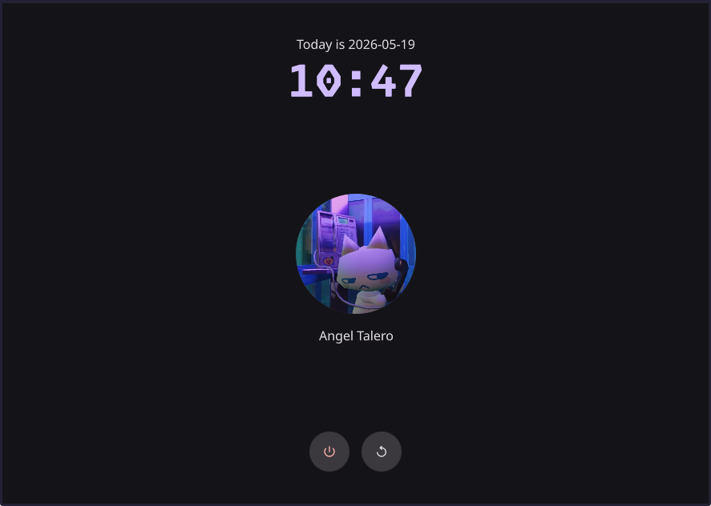
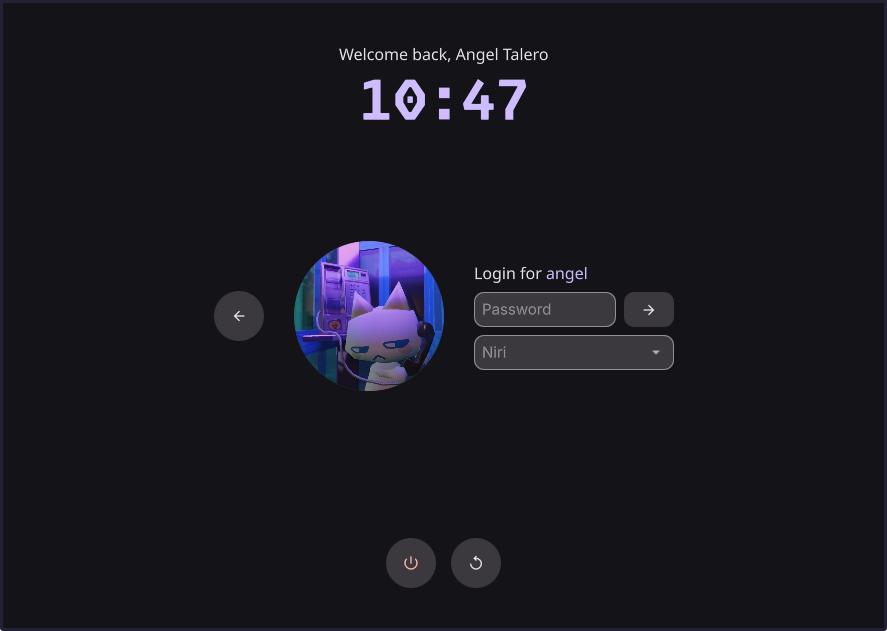

# qsgreeter

A [QuickShell](https://quickshell.org/)-based greeter for [greetd](https://sr.ht/~kennylevinsen/greetd/). It provides a simple QML-based login interface for Wayland.

| User List | Login Screen |
| :---: | :---: |
|  |  |

## 🪛 Installation

Only **Arch Linux** is officially supported, but installation only requires copying files into _quickshell_ directory.

### Arch Linux
Clone the repo and run `makepkg -si` to install the package with the provided [PKGBUILD](PKGBUILD).

```sh
git clone https://github.com/taleroangel/greetd-qsgreeter
cd greetd-qsgreeter
makepkg -si
```

### Other Distros
Clone the repo and copy `qsgreeter` into `/etc/xdg/quickshell/`

```sh
git clone https://github.com/taleroangel/greetd-qsgreeter
cd greetd-qsgreeter
sudo mkdir -p /etc/xdg/quickshell
sudo cp -r qsgreeter /etc/xdg/quickshell/
sudo chmod -R 755 /etc/xdg/quickshell/qsgreeter
```

## 🚀 Launch

To use **qsgreeter**, run the following command from your chosen Wayland compositor:

```sh
quickshell -c qsgreeter
```

i.e, running from Niri `spawn-at-startup "quickshell" "-c" "qsgreeter"`

### Using with Niri
If you have [niri](https://github.com/niri-wm/niri) installed, you can use the provided [niri configuration file](niri/qsgreeter-niri.kdl) to start the greeter automatically. Place the configuration file at `/etc/greetd/qsgreeter-niri.kdl` (Automatically installed when using `makepkg` on _Arch_) and edit `/etc/greetd/config.toml` to launch niri with the specified configuration:

```toml
[terminal]
vt = 1

[default_session]
command = "niri --config /etc/greetd/qsgreeter-niri.kdl"
user = "greeter"
```

## 🎨 Customization

Configuration files are located at `/etc/xdg/quickshell/qsgreeter`. You can customize the look and fell by editing `colorscheme.json` and `style.json`.

Since the greeter is written entirely in **QML**, you can also rearrange elements as you wish.

## 🤖 AI Disclosure
Code was written entirely by me, but AI was used for technical guidance
